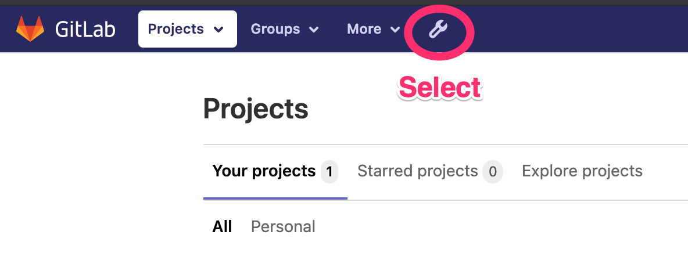

# Integrating EC2 MacOS Workers with EKS and GitLab

## What is this?

This project will walk you through integrating an EC2 MacOS instance with GitLab as a [runner](https://docs.gitlab.com/runner/). This project will build and deploy a new VPC with an EKS cluster, deploy a fault tolerant instance of GitLab, provision a MacOS EC2 instance, add the instance as a runner to GitLab, create a new hosted zone in Route 53, and create an S3 bucket that uses a least privileges security model with access from only the GitLab runner.  

## Why?

Getting a stable build environment up and running requires a lot of steps and this approach automates the entire process. Please note that this is an **example** and should be used as a guide for your site reliability engineering teams to develop their own production deployment. 

## Requirements

To deploy this environment, you will need to install [Pulumi](https://www.pulumi.com/docs/get-started/install/) and have the AWS CLI [installed](https://docs.aws.amazon.com/cli/latest/userguide/install-cliv2.html) and [configured](https://docs.aws.amazon.com/cli/latest/userguide/cli-configure-quickstart.html). Additionally, ensure that you have kubectl [installed](https://kubernetes.io/docs/tasks/tools/install-kubectl/) to work with your EKS cluster. Also, please make sure that you have the Kubernetes package manager, [Helm](https://helm.sh/docs/intro/install/), installed. 

**Please note, this project will be using Route 53 to host DNS for a domain we're using with GitLab. If you don't have an existing GitLab server please have a domain that you want to use (this is required for TLS certificate generation).**

## Cloning the Repo

First, clone the code from GitHub to get the project started.

```
bash$ git clone https://github.com/aws-samples/mac1-eks-gitlab.git
bash$ cd mac1-eks-gitlab/
```

## Provisioning EKS, GitLab, MacOS, Route 53, and an S3 Bucket

Now that you have configured the AWS CLI and generated your SSH key you are ready to begin launching the build environment.

We are going to be deploying multiple Pulumi [stacks](https://www.pulumi.com/docs/intro/concepts/stack/). Let's take a quick look at what stacks are available in the repo. 

```
bash$ ls
eks-vpc
mac-worker
r53-conf
s3-iam
```

**In this example we will be using the AWS [region](https://aws.amazon.com/about-aws/global-infrastructure/regions_az/), Oregon or us-west-2. If you want to use a different Region update the Pulumi configuration [parameters](https://www.pulumi.com/docs/intro/concepts/config/) in each stack.**

```
bash$ cd eks-vpc
bash$ pulumi config set aws:region us-west-2
bash$ cd ../mac-worker
bash$ pulumi config set aws:region us-west-2
bash$ cd ../r53-conf
bash$ pulumi config set aws:region us-west-2
bash$ cd ../s3-iam
bash$ pulumi config set aws:region us-west-2
```

### Creating an S3 Bucket for Artifacts

We want to have an S3 bucket to store artifacts from our GitLab runners. We also want to lock this bucket down so there is no public access - we only want the runners themselves to be able to read and write to this bucket. This is a best practice which follows a [least priviledge](https://docs.aws.amazon.com/AmazonS3/latest/dev/security-best-practices.html) security model. 

```
bash$ cd s3-iam
bash$ npm i
bash$ pulumi up -y
```

### Creating a New VPC and EKS Cluster

Next, let's deploy a new [Amazon VPC](https://aws.amazon.com/vpc/) and an [Amazon EKS](https://aws.amazon.com/eks/) cluster.

Provisioning an EKS cluster takes about 20 minutes so after you run the commands below feel free to grab a coffee then come back and check on your deployment.

```
bash$ cd ../eks-vpc
bash$ npm i
bash$ pulumi up -y
bash$ pulumi stack output kubeconfig > kubeconfig
bash$ export KUBECONFIG=`pwd`/kubeconfig
```

Next, you will want to run the aws eks update-kubeconfig and aws eks get-token commands to properly setup your kubeconfig or you can configure the KUBECONFIG environment variable as we have done in the previous command.

### Installing GitLab with Helm

To [install](https://docs.gitlab.com/charts/quickstart/) GitLab, please update the internet accessible domain (that you own) and email address in the command below. 

```
bash$ helm install gitlab gitlab/gitlab \                   
  --set global.hosts.domain=yourdomain.com \
  --set certmanager-issuer.email=admin@yourdomain.com
```

The installation takes about 5 minutes to complete. You can check the status with the following command.

```
bash$ kubectl get pods
NAME                                                    READY   STATUS      RESTARTS   AGE
gitlab-cainjector-67dbdcc896-wlxbl                      1/1     Running     0          47s
gitlab-cert-manager-564fc9d7f5-ctdqw                    1/1     Running     0          46s
gitlab-gitaly-0                                         1/1     Running     0          46s
gitlab-gitlab-exporter-5c4b45cff8-hw7bx                 1/1     Running     0          47s
gitlab-gitlab-runner-6bbf8c5fcf-9dqmb                   0/1     Running     0          47s
gitlab-gitlab-shell-df87cf6c-v5rrv                      1/1     Running     0          32s
gitlab-gitlab-shell-df87cf6c-whpvt                      1/1     Running     0          47s
gitlab-issuer-1-4htcq                                   0/1     Completed   0          47s
gitlab-migrations-1-92h6b                               1/1     Running     0          47s
gitlab-minio-56667f8cb4-cglkv                           1/1     Running     0          47s
gitlab-minio-create-buckets-1-5lvf4                     0/1     Completed   0          47s
gitlab-nginx-ingress-controller-5d475855bb-df2pj        1/1     Running     0          46s
gitlab-nginx-ingress-controller-5d475855bb-hbvxj        1/1     Running     0          46s
gitlab-nginx-ingress-default-backend-658cc89589-zhmk8   1/1     Running     0          47s
gitlab-postgresql-0                                     2/2     Running     0          46s
gitlab-prometheus-server-768cd8f69-fv828                1/2     Running     0          46s
gitlab-redis-master-0                                   2/2     Running     0          46s
gitlab-registry-9ddb975d6-frg58                         1/1     Running     0          47s
gitlab-registry-9ddb975d6-tpglb                         1/1     Running     0          47s
gitlab-sidekiq-all-in-1-v1-5b57f74dc4-swstj             0/1     Init:2/3    0          46s
gitlab-task-runner-95499488b-q48db                      1/1     Running     0          47s
gitlab-webservice-default-565765b8c-8qfwf               0/2     Init:2/3    0          46s
gitlab-webservice-default-565765b8c-zgkk9               0/2     Init:2/3    0          47s
```

When all of your Kubernetes pods have transitioned to "Running or Completed" the installation is done. 

Now, we need to get the Elastic Load Balancer hostname. Copy this hostname, we are going to use it to configure Route 53 shortly.

```
bash$ kubectl get ingress/gitlab-webservice-default -ojsonpath='{.status.loadBalancer.ingress[0].hostname}'
123456790281923943823-8675309.us-west-2.elb.amazonaws.com
```

### Configuring Route 53 to Use Your Domain

Next, we are going to configure Route 53. First, we are going to create a new hosted zone for your domain. Second, we will create a Route 53 ALIAS DNS record entry that maps gitlab.yourdomain.com (or whatever your actual domain name is) to the Elastic Load Balancer that was previously configured via Helm.

```
bash$ cd ../r53-conf
bash$ npm i
bash$ pulumi config set elb_hostname 123456790281923943823-8675309.us-west-2.elb.amazonaws.com 
bash$ pulumi config set domain_name yourdomain.com
bash$ pulumi up -y
```

Note the outputs that Pulumi generates.

```
Outputs:
    domain_name : "yourdomain.com"
    elb_hostname: "123456790281923943823-8675309.us-west-2.elb.amazonaws.com"
    ns1         : "ns-1463.awsdns-55.org"
    ns2         : "ns-1996.awsdns-58.co.uk"
    ns3         : "ns-296.awsdns-38.com"
    ns4         : "ns-790.awsdns-32.net"
```

You will need to update your domain's DNS to use Route 53's nameservers. If your domain is hosted by GoDaddy an example of how to update your nameservers can be found [here](https://medium.com/@jryancanty/domain-by-godaddy-dns-by-route53-fc7acf2f5580).


**Note that when you update the nameservers and configure Route 53, DNS propogation can take up to 15 minutes.**

### Logging into GitLab 

Now that you have updated Route 53, let's login to GitLab. The GitLab Helm [chart](https://docs.gitlab.com/charts/) has created a Kubernetes secret containing the root password to login. Use the following command to capture the password. 

```
bash$ kubectl get secret gitlab-gitlab-initial-root-password -ojsonpath='{.data.password}' | base64 --decode ; echo
1234567890abcdefghijklmnopqrstuvwxyz
```

Now in your web brower, go to https://gitlab.yourdomain.com (or whatever your domain you chose). The login username is "root" and use the password from the 'kubectl get secret' command output.


Now that you have logged in, we want to get the runner registration token to add EC2 workers to GitLab.

Click on the wrench icon (settings) at the top.



Next, click on runners.


Next, copy the registration token. We are going to use this for our EC2 MacOS instance configuration.


### Creating an EC2 MacOS GitLab Runner

We need to get your current organization name that you configured when you installed Pulumi. To do this run the following command and set a configuration parameter. We are setting this parameter because we are referencing [outputs](https://www.pulumi.com/docs/intro/concepts/programming-model/#outputs) from your EKS, S3, and Route 53 stacks.

```
bash$ cd ../mac-worker
bash$ npm i
bash$ pulumi whoami
my-org-name
bash$ pulumi config set pulumi_org my-org-name
```

Next, you will need to [create an SSH key](https://docs.aws.amazon.com/AWSEC2/latest/UserGuide/ec2-key-pairs.html) in the AWS console if you don't already have one. Give it the name "pulumi-key” or another name that you would prefer (we will use this shortly).

We are now going to use the registration token for the GitLab runner. We are also going to use the SSH key you created in the console in the first step to allow secure logins. An inbound EC2 security group is also automatically provisioned that only allows port 22 inbound access.

```
bash$ cd ../mac-worker
bash$ pulumi config set --secret reg_token 123456789-my-token-goes-here-987654321
bash$ pulumi config set ssh_keyname pulumi-key
bash$ pulumi up -y
```
**Note that it takes about 15 minutes to create and configure the MacOS GitLab runner.**

After about 15 minutes, you can now log back into your GitLab instance (https://gitlab.yourdomain.com/admin/runners) and validate that the runner has successfully registered.


Now that you have successfully added a runner, you will need to create a [project](https://docs.gitlab.com/ee/user/project/#projects) to kick off any automated builds. Your GitLab project will require a [.gitlab-ci.yml](https://docs.gitlab.com/ee/ci/yaml/README.html) file that will tell the runner what to do when code has been committed to the repo. 

